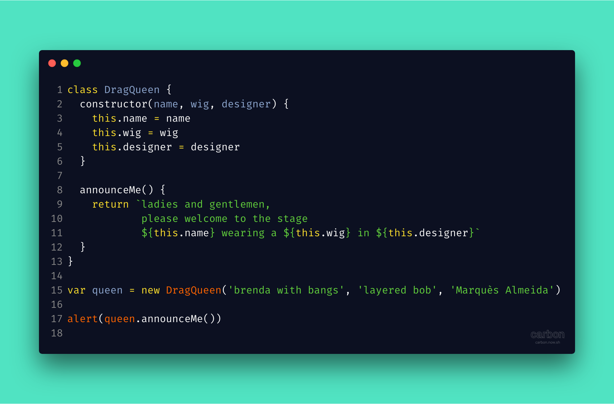
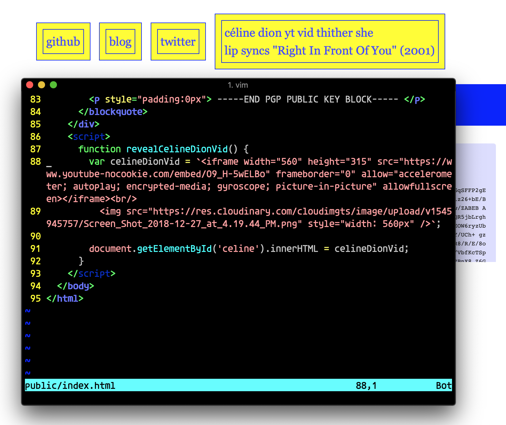

# gaythub

Gay dev stuff, gay functions, _even gay monads_. 

Inspired by [@murphybrandon](https://www.github.com/murphybrandon) wanting 2 see more gay examples vs. `calcBaseballBattingAvg() -> whoKnows -> whoCares!` and by seeing myself type out, too late, `revealCelineDionVid()` on [tylsyl.com](https://www.tylsyl.com) (guess what link it governs).

Honey, submit a PR if you find something similar, honey! :~)

